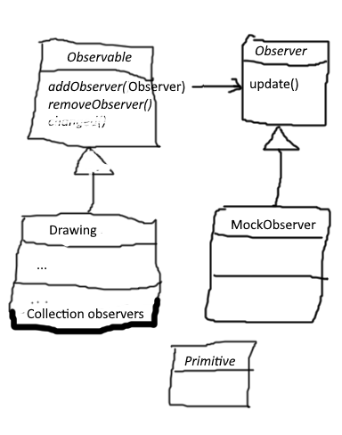
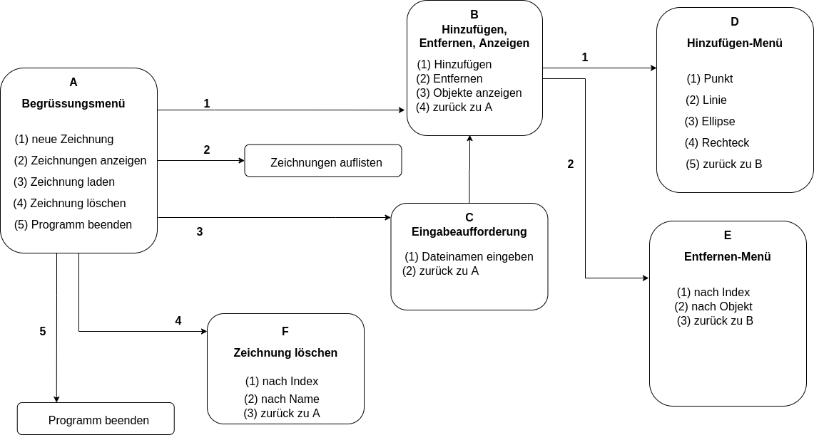
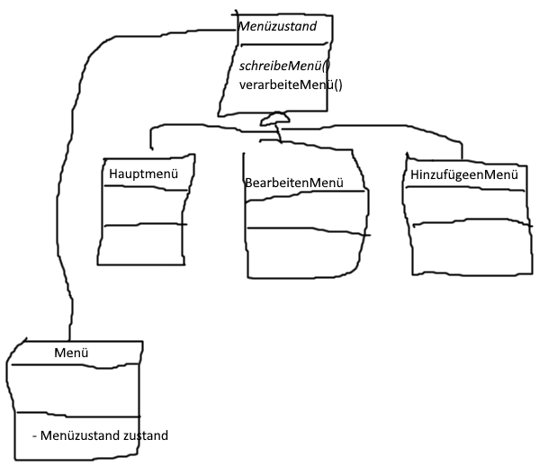
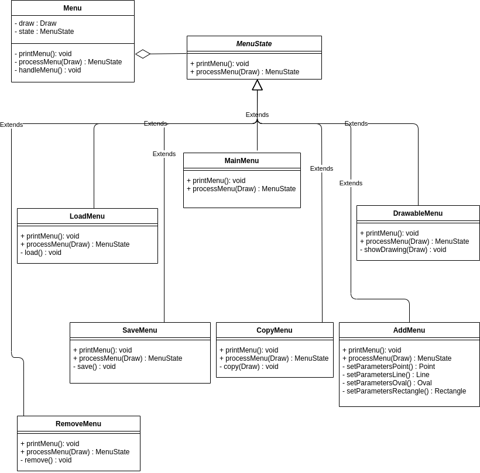

# Projekt _**Graphic**_ zur Einführung in OOP

Wir werden nun ein Projekt anfangen, welches wir sukzessive alle drei parallel entwickeln und dabei verschiedene Techniken der Entwicklung von Software nutzen.

Die meiste Zeit werdet ihr selbständig das Projekt entwickeln.

## Referenzen
Standardwerke für die Javaentwicklung
- [Java ist auch eine Insel](https://amzn.to/3bBG7vt) ([Web-Version](http://openbook.rheinwerk-verlag.de/javainsel/))
- [Effective Java](https://amzn.to/2XyfEH4) ([Deutsche Ausgabe](https://amzn.to/38Dr6HK))
- [Clean Code](https://amzn.to/2P85FVA) ([Deutsche Ausgabe](https://amzn.to/2Xzdnvp))
- [Design Pattern](https://amzn.to/2LjTqGv) der Gang of four ([Deutsche Ausgabe](https://amzn.to/2XB0UqT))

Dokumentation
- [Git Anwendungshandbuch](https://git-scm.com/book/de/v2)
- [JUnit 5 User Guide](https://junit.org/junit5/docs/current/user-guide/)
- [Studienprojekt Design Pattern](https://www.philipphauer.de/study/se/design-pattern.php)

## Wiederholung

Der Heutige Schwerpunkt ist die Wiederholung OOP.

    Klassen, Vererbung, Konstruktoren, Member, Getter/Setter, Membermethoden
    Collection, List, Map
    JUnit
    Maven

Im Anschluss daran, sollt ihr euch, mit Hilfe des Internet, Design Pattern erarbeiten.

    Was sind Design Pattern?
    Wozu benötige ich Design Pattern?
    Klassifikation von Design Patterns

Konkret sollt ihr euch dann noch die Design Pattern

    MVC (im Kontext der Desktopentwicklung)
    Observer-Pattern
    State-Pattern

anschauen.

Einen guten Einstieg zeigt die Seite https://www.philipphauer.de/study/se/design-pattern.php.

Ein gutes Buch zu Design Pattern, bzw. DAS BUCH ist von der Gang of four (Erich Gamma, Richard Helm, Ralph Johnson, John Vlissides) mit dem Titel Design Pattern. Dies gibt es auch in einer Deutschen Übersetzung und heißt Entwurfsmuster. (https://de.wikipedia.org/wiki/Entwurfsmuster_(Buch))

## Tag 1

heute wird jeder selbstständig eine Klassenstruktur für primitive Grafikelemente entwerfen. Dabei wollen wir vorerst die Primitiven Punkt, Linie, Ellipse und Rechteck mit den entsprechenden Member und Zugriffsmethoden entwickeln.

Anschließend entwirft jeder selbstständig eine Klasse, die Instanzen dieser Primitiven zu einer Zeichnung zusammenfasst. Diese Zeichnung benötigt natürlich auch sinnvolle Member und Methoden.

Außerdem ist mit Tests sicherzustellen, dass die Methoden der neu entworfenen Klassen so arbeiten, wie wir es uns vorstellen.

Der Schwerpunkt soll hier auf Schnittstellen, Klassen und deren Konstruktoren, Member und Methoden liegen. Außerdem wird die Collection-API eine Rolle spielen und einfache JUnit-Tests müssen erstellt werden.

Gegen 8:45 würde ich mich gern mit euch unter https://meet.jit.si/FIAE unterhalten und die Aufgaben besprechen.

## Tag 2

- Git
  - [Git Anwendungshandbuch](https://git-scm.com/book/de/v2)
  - commit und push
  - Tag erstellen
  - Projekt clonen
- Diskussion des gestrigen Tages
- Observer Pattern
- Selbständiges implementieren des Observer mit Hilfe des UML-Diagramms

- Verwendung des Observer Pattern in unserer Zeichnung

- Nutzung von JUnit
  - [JUnit 5 User Guide](https://junit.org/junit5/docs/current/user-guide/)

## Tag 3

- Diskussion und Verfeinerung des implementierten Observer Patterns unserer Zeichnung
- Wiederholung der Woche

## Woche 2

#### Aufgabe

Es ist ein Kommandozeilentool zu erstellen, mit dem man die folgenden Operationen durchführen kann:
- Neue Zeichnung erstellen
- Grafikelemente erzeugen und zur Zeichnung hinzufügen
- Grafikelemente aus der Zeichnung löschen
- Grafikelemente als Text ausgeben
- Zeichnung laden und speichern

**Thema**
- Wiederholung der Vorwoche
- Entwurf eines Menüsystems  
  
[Menü von CodaCodalis](https://github.com/CodaCodalis/Graphic#tag-4)
- Selbstständiges anlesen des State Patterns
- Entwurf eines Menüsystems mit Hilfe von UML  

- Implementierung des Menüs anhand des UML-Diagramms  
  
[Menü von nb-crypto](https://github.com/nb-crypto/Graphic#tag5)
- Überschreiben der toString-Methode der Primitive, falls noch nicht geschehen

**IO~~Stream~~-API**

Stream-API in diesem Zusammenhang ist ein veralteter Begriff, da mit Java 8 und der Einführung mit Streams dieser Begriff missverständlich ist.
Man benutzt hierfür nun nur noch, auch den zu dieser Zeit schon verwendeten Begriff, IO-API bzw. NIO-API.
 
Durcharbeiten der Kapitel zur IO~~Stream~~-API in dem Buch [Java ist auch eine Insel - 17 Datenströme](http://openbook.rheinwerk-verlag.de/javainsel9/javainsel_17_010.htm)  
*(ACHTUNG: Dies ist nicht dieselbe Auflage wie oben genannt!)*  
insbesondere der Kapitel
- [17.1 Stream-Klassen und Reader/Writer am Beispiel von Dateien](http://openbook.rheinwerk-verlag.de/javainsel9/javainsel_17_001.htm)
- [17.2 Basisklassen für die Ein-/Ausgabe](http://openbook.rheinwerk-verlag.de/javainsel9/javainsel_17_002.htm)
- [17.4.4 Mit »ByteArrayOutputStream« in ein Byte-Feld schreiben](http://openbook.rheinwerk-verlag.de/javainsel9/javainsel_17_004.htm)
- [17.4.5 Mit »ByteArrayInputStream« aus einem Byte-Feld lesen](http://openbook.rheinwerk-verlag.de/javainsel9/javainsel_17_004.htm)
- **[17.10 Persistente Objekte und Serialisierung](http://openbook.rheinwerk-verlag.de/javainsel9/javainsel_17_010.htm)**

Implementierung der Laden- und Speichern-Funktionalität mit Hilfe der Java-Standard-Serialisierung

- Lose Kopplung
- Entwicklung gegen Schnittstellen
- Austauschbarkeit von Implementierungen

- Exceptions kurz angesprochen (ohne try-with-Resource)

- Serializable: serialVersionUID und transient besprochen

Selbstständiges fertigstellen der Implementierung der Anwendung.

